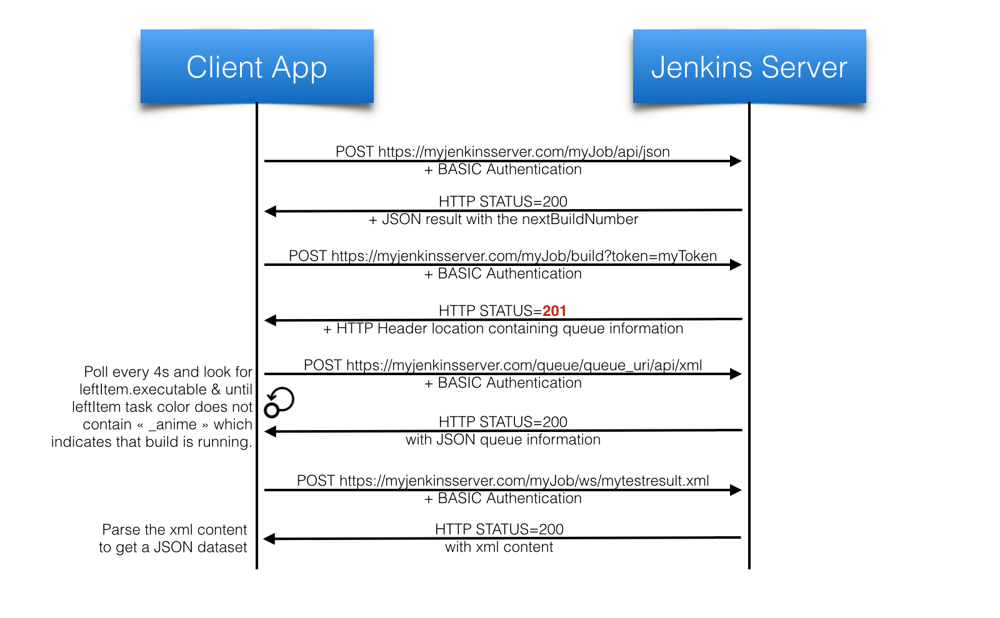

# 3JApp
Javascript Jenkins JUnit Application

## Context
For a project, I was looking for a tool that could launch Jenkins Jobs remotely (from a cellphone). So I decided to use the Jenkins APIs and follow the recommendations on the [Jenkins Remote access API page] (https://wiki.jenkins-ci.org/display/JENKINS/Remote+access+API) to develop something on my own.
I also wanted to learn something out of it, to follow current web and mobile trends so I ended up developing a Cordova/Ionic based solution.

## Implementation
As stated above, this application is based on Cordova/Ionic framework (so it uses AngularJS + a couple of components).

The test suite I worked with was written using SOAP UI so I tested with a Jenkins Job that triggers a SOAP UI project.
(Note that the default parameters point to a test environment - availability/performance not guaranteed).

Most of the logic is available in the 'js/controller.js' file.

Below is a sequence diagram:

## Installation
Clone the repository in your 'www' folder of any web server or of your Ionic app folder.
Change the settings dynamically in the app to reach your own Jenkins server or change the default settings in the js/data/settings.json file.

## Compatibility
This app has been tested with the following tools and their respective versions: 

Tools         | Version
------------- | -------------
SOAPUI        | 5.2.1
Jenkins       | 1.642.2
Ionic         | 1.7.16
NgCordova     | 0.1.26-alpha
AngularJS     | 1.5.3
x2js          | 1.2.0
 
This application has been successfully tested on an Android cellphone (Galaxy Note 5 - Android 6.0.1) and on Safari (Mac) and Google Chrome.

## Limitations
*  No support of the build parameters yet.
*  Basic Job automation (no concurrency, no job cancellation...).
*  API Authentication required.
*  Only one TestSuite per test result file (.xml file).

## Possible improvements
*  Supporting the current limitations.
*  Saving the Setting changes.
*  Putting some hardcoded variables (timeouts) in settings.

